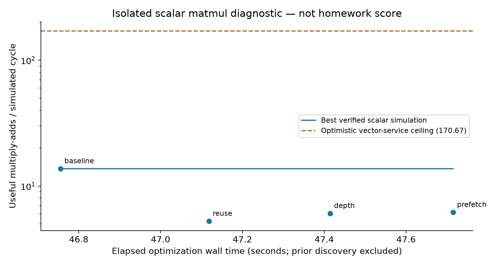
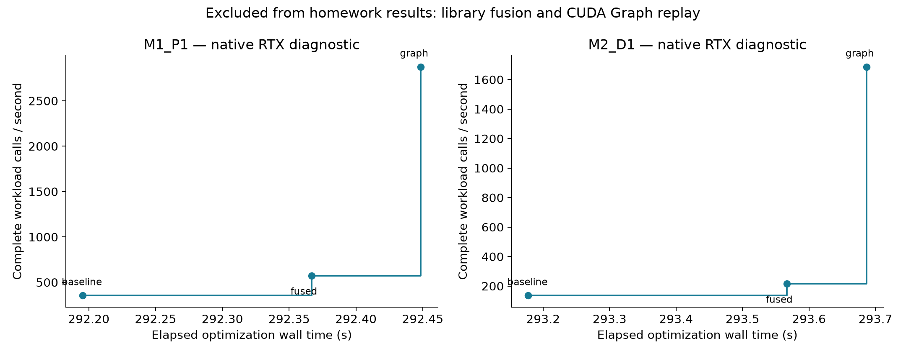

# Recorded experiment results

These experiments test individual optimization mechanisms. They do not yet test the self-evolving solver proposed in the [general research proposal](general_research_proposal.md). Their timing units and execution environments differ and should not be combined into one speedup.

## Scalar matrix multiplication in a simulator

For an 8-by-32 matrix multiplied by a 32-by-64 matrix, smaller cycle counts are better. The baseline took 1,191 cycles; row reuse took 3,109; a larger staging depth took 2,699; prefetching took 2,645. All four passed the declared numerical and race checks. None improved the baseline. Reducing modeled memory traffic did not compensate for the added execution costs in this small case.

See the [method](iteration_001/experiment.md) and [measurements](iteration_001/measurements.json).

## Complete workloads on an RTX 5090

The table reports median synchronized host milliseconds per inference call over seven groups of ten calls. Smaller is better. Prefill processes the prompt and continuation; decode performs eight sequential steps. The [method](gpu_iteration_001/experiment.md) defines shapes, tolerances and timing exclusions. All candidates passed reference comparisons on three seeds; graph replay was also checked with changed resident inputs.

| Workload | Explicit baseline | Fused normalization and activation | Fused implementation with CUDA Graph replay |
| --- | ---: | ---: | ---: |
| Prefill | 2.82876 | 1.74526 | 0.34804 |
| Decode | 7.39497 | 4.65821 | 0.59319 |

These gains concern small fixed-shape workloads and launch overhead. Input transfers, graph capture and initial allocation are outside inference latency. They do not establish the accuracy of the original maximum-flow model or general serving performance. [Full timing samples and checks](gpu_iteration_001/measurements.json).

## Complete workloads in the course simulator

The compact four-row normalization candidate completed the unchanged local v0.7.3 full grade and met its eligibility checks. Its local score was **30,518.5267**, with **773,243 prefill cycles** and **56,040 decode cycles**. Functional checks passed for both workloads. The run took 1,323.77 seconds. This is a local grade, not a confirmed grading-server result. The [selected grade fields and original report hash](homework_iteration_001/grade_summary.json) preserve its evidence boundary; [the experiment plan](homework_iteration_001/experiment.md) describes the comparison.

A separate decode coalescing diagnostic passed numerical/race checks but took 57,186 cycles versus 56,040 for the incumbent and exceeded the 20 W limit at approximately 20.2066 W. It was rejected. A separate simple-baseline full grade stopped at its 4 GiB memory guard without a verdict; subsequent tile-selection and shared-panel grades were not launched. The [prospective plan](homework_basic_sequence/experiment.md) is not a record of completed stages.

The public snapshot includes reports, selected evidence and plots. It does not package the course toolchain or all generated assembly; the original synthetic model remains independently runnable from the repository root.
